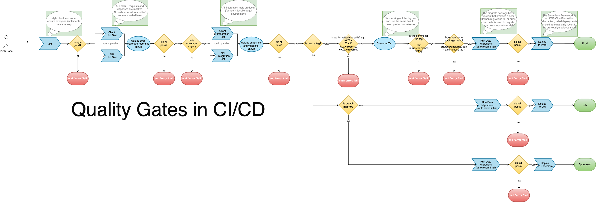

 ([original draw.io file](https://app.diagrams.net/#G1MAdckksLJ2GoWbNJXtwGSnA4tjsecsHI))

# CICD

## CI/CD Quality Gates
    .github/workflows/quality-gates.yml

&nbsp;

1. ### Lint Check
    - lints files in repo according to `.eslintrc.js` configuration

2. ### Client Unit Tests
    - Is run in parallel with `API Unit Tests` job
    - Requires `Lint Check` job to pass to run
    - runs `src/web/package.json > scripts > test-unit:ci` 
    - runs jest with config: `src/web/jest.config.ts` and coverage on
      - coverage definitions come from a config file that is shared by client and api: `shared-jest.config` in project root
    - **IMPORTANT**: Mock all external calls to APIs and services for test isolation and idempotent results in pipelines
    - **Conditions to Pass**:
      - All tests must pass
      - Coverage must be:
        - **branches**: >= 75%,
        - **functions**: >= 75%,
        - **lines**: >= 75%,
        - **statements**: >= 75%
  
3. ### API Unit Tests

    - Is run in parallel with `Client Unit Tests` job
    - Requires `Lint Check` job to pass to run
    - runs `package.json > scripts > test-unit:ci` 
    - runs jest with config: `jest.config.ts` and coverage on
      - coverage definitions come from a config file that is shared by api and client: `shared-jest.config` in project root
    - **IMPORTANT**: Mock all external calls to APIs and services for test isolation and idempotent results in pipelines
    - **Conditions to Pass**:
      - All tests must pass
      - Coverage must be:
        - **branches**: >= 75%,
        - **functions**: >= 75%,
        - **lines**: >= 75%,
        - **statements**: >= 75%

4. ### Client Integration Tests

    - Is run in parallel with `API Integration Tests` job
    - Requires `API Unit Test` and `Client Unit Test` jobs to pass to run
    - runs `src/web/package.json > scripts > test-integration:ci` 
    - runs cypress and a local web client
    - uses `runner.js` to set some dynamic environment variables needed in order to provide proper test context
    - **Conditions to Pass**:
      - All tests must pass
        - failures will generate snapshots and/or videos, which will be uploaded to github
  
5. ### API Integration Tests
    
    - Is run in parallel with `Client Integration Tests` job
    - Requires `API Unit Test` and `Client Unit Test` jobs to pass to run
    - runs `package.json > scripts > test-integration:ci` 
    - runs cypress and a local api server
    - uses `runner.js` to set some dynamic environment variables needed in order to provide proper test context
    - **Conditions to Pass**:
      - All tests must pass
        - failures will generate snapshots and/or videos, which will be uploaded to github

6. ### If push is a branch...
   - If branch is **not** `master`...
     - Deploy ephemeral environment to: `{gh username}-{urlsafe branchname}.{domainname.com}`
   - If branch **is** `master`...
     - Deploy dev environment to: `dev.{domainname.com}`

7. ### If push is a tag...
   - Deploys to `prod` if tag:
     - is formatted correctly (must be valid semver `X.X.X` or `vX.X.X`)
     - tag (commit hash) is found in `master` branch history
     - semver matches version in `package.json` and `src/web/package.json`

## Reversion Tags
    .github/workflows/revert-environment.yml

&nbsp;

1. ### If push is a tag...
   - Reverts `prod` to a previous release if tag:
     - is formatted correctly (must be semver `X.X.X` or `vX.X.X-revert-X`)
     - is a reversion tag (tag contains `-revert-`)
     - tag (commit hash without `-revert-` token) is found in `master` branch history
     - tag semver matches version in `package.json` and `src/web/package.json` in the historic tag/commit

## Ephemeral Cleanup
    .github/workflows/revert-environment.yml

1. ### When a branch is deleted
    - If branch is not `master`, any existing ephemeral environment for the current branch in aws is removed/undeployed